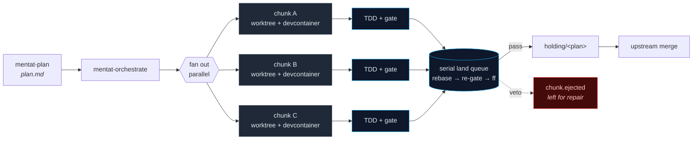

<h1 align="center">Mentat</h1>

<h3 align="center">Parallel agents with vertical slices, devcontainers, and a serial merge queue</h3>

<p align="center">
  Fan out coding agents across isolated git worktrees + devcontainers.<br/>
  Land each slice back onto a holding branch through a scored, serial gate.
</p>

<p align="center">
  <a href="./docs/ARCHITECTURE.md"><strong>Architecture</strong></a> ·
  <a href="./CONTEXT.md"><strong>Glossary</strong></a> ·
  <a href="./docs/adr/README.md"><strong>ADRs</strong></a> ·
  <a href="https://github.com/matheushenriquefs/mentat/issues"><strong>Issues</strong></a>
</p>

> *"Once men turned their thinking over to machines in the hope that this would set them free. But that only permitted other men with machines to enslave them."*
>
> — Frank Herbert, *Dune*

## Why Mentat

Long-running coding agents drift. Context compacts, hooks collide with sandboxed runs, and one wrong commit can poison the rest of a session. Sequential loops squander wall-clock time on work that does not need to be serial — but naive parallel fan-out produces merge conflicts, half-finished chunks, and review burden that scales linearly with the agent count.

Mentat structures the work instead. Plans are split into vertical slices that can be implemented independently. Slices run in parallel, each in its own worktree and devcontainer so pre-commit hooks and project tooling stay isolated. A serial merge queue rebases and re-gates each chunk before it joins the holding branch, so failures eject one chunk at a time without blocking the rest.

## How it works

A plan is split into vertical slices. Each slice fans out in parallel as a *chunk* — its own worktree, devcontainer, and branch. Chunks land back through a serial queue that rebases, re-gates, and fast-forwards onto a holding branch.



## Requirements

| | |
|---|---|
| **Python** | 3.11+ (stdlib only at the bin layer) |
| **Docker** | 24+ with daemon running |
| **devcontainer CLI** | `npm i -g @devcontainers/cli` |
| **git** | 2.40+ (worktree support is load-bearing) |
| **OS** | macOS, Linux |

Project tools (`ruff`, `pyright`, `uv`, `pytest`) run inside the devcontainer — they do not need to exist on the host.

## Install

Idempotent — clones source under `~/.local/share/mentat`, then sets up `~/.mentat/` + `~/.agents/` + harness symlinks.

```bash
# interactive
curl -fsSL https://raw.githubusercontent.com/matheushenriquefs/mentat/main/install.sh | bash

# skip confirmation
curl -fsSL https://raw.githubusercontent.com/matheushenriquefs/mentat/main/install.sh | bash -s -- --yes

# preview only
curl -fsSL https://raw.githubusercontent.com/matheushenriquefs/mentat/main/install.sh | bash -s -- --dry-run
```

## Quick Start

```bash
# 1. plan — grill requirements, write ~/.agents/plans/add-csv-export-plan.md
/mentat-plan add-csv-export-plan

# 2. orchestrate — fan slices out as parallel chunks, land serial onto holding
/mentat-orchestrate run holding/add-csv-export add-csv-export-plan

# 3. watch the batch land
/mentat-session track

# 4. inspect ejected chunks (if any)
/mentat-session doctor

# 5. review what landed on holding before merging upstream
/mentat-git diff main..holding/add-csv-export
```

## What it does

| Capability | Detail |
|---|---|
| **Vertical-slice plans** | Tracer-bullet `plan.md` files. Each slice independently landable. |
| **Parallel fan-out** | Worktree + devcontainer + branch per chunk. Up to 3 concurrent. |
| **Serial land queue** | Rebase onto holding tip in-container, re-gate, fast-forward. No merge commits, no host pre-commit collisions. |
| **Scored review gate** | 5 reviewer subagents (plan / test / bug / smell / context) emit JSON verdicts. Never average — veto > threshold. |
| **Anti-cheat blacklist** | Trajectory scanner in `mentat-bug-reviewer` hard-vetoes forbidden moves (test-runner redirection, asserting the inverse). No threshold mediation. |
| **AFK vs HITL** | Slice-level tags control whether agents stall for human review or proceed unattended. AFK depends on the scored gate. |
| **Audit envelope** | Every command emits start + complete events. NDJSON to `~/.mentat/logs/<repo>/<session>/`. |
| **Harness-agnostic** | Pluggable headless-agent CLIs (`claude-code`, `cursor` today). Drop a module to add another. |
| **Plugin API** | Extend rubrics and gates without forking core. |
| **Stdlib-only bin layer** | Installs without pip. Dev layer uses `uv` / `ruff` / `pyright` / `pytest`. |

## Development

Contributing to Mentat itself (not running it on a target repo):

```bash
task install   # uv sync — dev dependencies (ruff, pyright, pytest)
task check     # lint + format + typecheck
task test      # pytest tests/
```

## Troubleshooting

| Symptom | What to try |
|---|---|
| Chunk ejected, unclear why | `/mentat-session doctor` — writes `diagnosis.md` alongside the session log. |
| Container won't come up | `mentat-container doctor` — diagnoses Docker daemon, arch mismatch, missing devcontainer.json. |
| `mentat-container run` fails with exit 69 | Container not running for current worktree — `mentat-container up` first. Never fall back to host or `docker exec` (ADR-0004). |
| Land queue stuck on rebase | The chunk's branch is not fast-forward onto holding. Inspect with `mentat-git diff holding/<plan>..HEAD`; rebuild the slice and re-run. |
| Companion install left a half-state | Re-run the install one-liner — symlinks are idempotent and broken ones are reported as stale. |

## Documentation

| | |
|---|---|
| [Architecture](./docs/ARCHITECTURE.md) | Narrative overview, 15 sections, ADR pointers. |
| [Glossary](./CONTEXT.md) | Domain lexicon — slice / chunk / batch / land / eject / AFK / HITL. |
| [ADRs](./docs/adr/README.md) | 10 architecture decision records, 0001–0010. |
| [Filesystem layout](./.agents/docs/PATHS.md) | Every path Mentat reads or writes. |
| [Style guide](./docs/STYLE.md) | Voice classes, LOC budgets, banned words. |
| [Plugin API](./docs/PLUGINS.md) | Rubric + gate extension slots. |
| [Exit codes](./docs/EXIT-CODES.md) | BSD sysexits convention. |

## License

MIT. See [CREDITS.md](./CREDITS.md) for attributions and inspirations.
